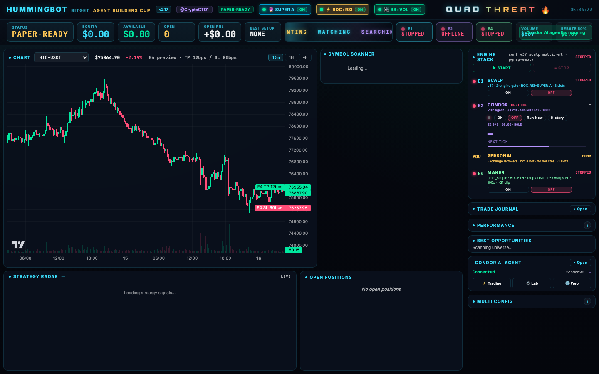

# Quad Threat

**Bitget USDT-M multi-engine desk** — one account, three trading engines + Cup dashboard. **Condor is the entry:** it deploys Engine 1 and Engine 4 as Hummingbot bots (`manage_bots`) and runs Engine 2 as its own loop.

Public snapshot for Michael / Bitget sandbox. Sized for an **~$800** book. Clone this pack, install upstream Hummingbot + Condor, copy controllers/agent/conf in, paper first. Do **not** use these sizes on a ~$60 live account.

| Piece | What it is |
|---|---|
| **Orchestrator** | Condor agent `quad_threat_orchestrator` — `manage_bots` deploy of E1 + E4 |
| **Engine 1** | Hummingbot controller `v37_scalp_multi` (bot `quad-e1`) |
| **Engine 2** | Condor agent `v37_risk_manager` / `disciplined_perps_strategy` |
| **Engine 4 (Maker)** | Hummingbot `pmm_simple` BTC+ETH (bot `quad-e4`) |
| **Dashboard** | Custom Cup UI (`hbot_dash.py` + `hbot-dashboard.html` + `hbot_server.py`) on `:8770` |

### Engine 3 — Engine Free (manual / personal)

**Engine 3 is not an automated strategy.** There is no Hummingbot controller or Condor agent for it.

It is **Engine Free**: optional **manual trading** on the same Bitget account. After (or outside) the competition, the end user can place personal trades by hand. Those fills still land on the shared account and roll into **overall performance / journal / volume** on the Cup dashboard.

- **Not required for the competition sandbox** — E1 + E2 + E4 are enough.
- Shipped only as a **precaution / desk flexibility** so humans can trade leftovers without a fifth bot.
- Pair ownership still matters: avoid fighting E1/E2/E4 on the same symbols while those engines are live.

```
Condor orchestrator ──► manage_bots ──► Engine 1 (quad-e1) + Engine 4 (quad-e4)
Condor Engine 2     ──► LLM basket opens + overlay
Dashboard           ──► watches all three, journal
```

See `quad-threat-flowchart.png` if present.

---


## Dashboard



Live Cup UI on `:8770` — engines, open positions, performance, and journal in one view.

## What Quad Threat is

- **Venue:** Bitget USDT-M perpetuals (`bitget_perpetual`), one-way mode
- **Account model:** one live account shared by E1 + E2 + E4
- **Built on:** upstream [Hummingbot](https://github.com/hummingbot/hummingbot) V2 controllers + [Condor](https://github.com/hummingbot/condor)
- **This repo is not a full fork** — it is the custom controllers, Condor agent pack, conf snapshots, helper scripts, and Cup dashboard

---

## How the four pieces play together

### Pair ownership

| Who | Opens | Closes / manages | Must not open |
|---|---|---|---|
| **E1** | Ensemble scalp across `conf/universe.yml` | Own SL/TP/trail | — |
| **E2** | Breakout basket only (see live snapshot) | Own E2 legs + overlay flatten of E1/E4 on invalid thesis or 3% DD | BTC/ETH (E4), stocks, SOL, XRP |
| **E4** | Two-sided quotes BTC-USDT + ETH-USDT | Inventory TP/SL / rebalance | Extra pairs unless you add confs |

### Slots

- **E1 scalp slots:** `max_open_positions` from universe / conf (live snapshot: **3**). Maker inventory does **not** consume E1 slots.
- **E2 slots:** up to **3** Engine-2 executors (`max_open_executors: 3`).
- **E4:** separate bot/container (`hummingbot-e4`) with its own script conf; does not take E1 slots.

### Who opens / closes

1. **E1** opens when ≥2 of 3 signal engines agree above `score_threshold` and a scalp slot is free.
2. **E2** ticks every `frequency_sec` (live: 300s). Opens only via Condor `create_position_executor` (sized by the `e2_order_sizer` routine) on the allowed basket. May flatten E1/E4 when thesis dies or daily DD hits 3% — not for “take $0.80 profit” on E1 (E1 already has barriers).
3. **E4** continuously quotes; fills become inventory worked with limit TP + stop.
4. **Engine 3 (Engine Free)** is optional manual trading. Personal fills on this account still count toward overall performance; it is not needed to run the competition stack.
5. **Dashboard** is observe + orchestration UI. It does not replace the engines.

---

## Engine 1 — `v37_scalp_multi`

- Path: `controllers/generic/v37_scalp_multi.py`
- Conf: `conf/controllers/conf_v37_scalp_multi.yml` + `conf/universe.yml` + `conf/active_strategy.json`
- Connector: `bitget_perpetual`
- Signals: SUPER_A, ROC_RSI, BB_VOL (toggles in `active_strategy.json`)
- Geometry (live snapshot): SL **0.8%**, TP **1.6%**, trail **1.2% / 0.8%**, cooldown **1500s**, time limit **3h**, score **0.66**
- Margin: **`$25`** per position on an **$800** book (`position_size_quote`); leverage from universe map (SOL/XRP 10x, else 5x). Skip E2 basket and BTC/ETH.

Install into a Hummingbot tree under `controllers/generic/` and matching `conf/`, then import/start with your usual V2 + controllers flow (`scripts/v2_with_controllers.py` included as the wrapper used live).

---

## Engine 2 — Condor `v37_risk_manager`

- Pack: `condor-agent/v37_risk_manager/`
  - `AGENT.md`
  - `loops/disciplined_perps_strategy/{loop.md,config.yml,learnings.md}`
  - `routines/market_analysis.py` + `routines/__init__.py`
- Optional MCP tool: `condor-mcp/executors.py`
- LLM: set `agent_key: openrouter:YOUR_MODEL_HERE`
- Margin on $800 book: **$25** × 3 (`total_amount_quote: 75`)

Copy the agent folder into Condor `agents/`. Start in **paper** first.

---

## Condor wrap — `quad_threat_orchestrator`

Cup rule: the judged run is a **Condor agent that deploys/manages** the V2 controllers. CLI-only `hummingbot_quickstart` is not the entry.

- Pack: `condor-agent/quad_threat_orchestrator/`
- Tick 120s. Tools: `manage_bots` only. **Does not trade.**
- Deploys bot `quad-e1` with `conf_v37_scalp_multi.yml`
- Deploys bot `quad-e4` with `conf_e4_pmm_btc.yml` + `conf_e4_pmm_eth.yml`
- Engine 2 stays a **separate** Condor strategy (`v37_risk_manager`)

All three engines still run side-by-side. Condor is who starts E1/E4.

---

## Engine 4 (Maker) — `pmm_simple`

- Controller: `controllers/market_making/pmm_simple.py`
- Live confs in pack:
  - `conf/e4/controllers/conf_e4_pmm_btc.yml`
  - `conf/e4/controllers/conf_e4_pmm_eth.yml`
  - `conf/e4/scripts/conf_e4_pmm.yml`
- Live BTC/ETH snapshot from YAML: spreads **`0.0008` (8 bps)** each side, refresh **30s**, `total_amount_quote: 800` (~$4 margin/fill at 100×), leverage **100**, SL **0.15%**, TP **0.06% LIMIT**, `time_limit` **7200s**, ONEWAY
- Script conf is **BTC+ETH only** (no XRP/DOGE)

---

## Dashboard (Cup)

- `dashboard/hbot_dash.py` — launcher
- `dashboard/hbot_server.py` — API + static server (live desk uses **:8770**)
- `dashboard/hbot-dashboard.html` — UI (Engine stack, slots, Condor, E4 controls, journal)

Point `HBOT_*` paths at your local Hummingbot/Condor installs. No keys in the HTML.

---

## Current pack snapshot ($800 book)

- **E2 OPEN basket:** XAU-USDT, CL-USDT, DOGE-USDT, NEAR-USDT, LTC-USDT (20×) · **$25** margin
- **E2 model:** `agent_key` placeholder `openrouter:YOUR_MODEL_HERE`
- **E4:** BTC+ETH only · 8 bps · TP 6 bps LIMIT · SL 15 bps · refresh **30s** · time_limit **7200s** · 100× · quote **800**
- **E1:** max 3 · **$25** · score 0.66 · does not open E2 basket or BTC/ETH
- **Orchestrator:** Condor `manage_bots` for `quad-e1` + `quad-e4`


## Repo layout

```
quad-threat/
├── README.md
├── CUP-APPLICATION.md
├── LICENSE
├── .env.example
├── .gitignore
├── quad-threat-flowchart.png          # if present
├── controllers/
│   ├── generic/v37_scalp_multi.py     # Engine 1
│   ├── market_making/pmm_simple.py    # Engine 4
│   └── directional_trading/           # optional; empty init (no Engine 3)
├── conf/
│   ├── universe.yml
│   ├── active_strategy.json
│   ├── controllers/conf_v37_scalp_multi.yml
│   └── e4/...
├── condor-agent/v37_risk_manager/     # Engine 2
├── condor-agent/quad_threat_orchestrator/  # manage_bots E1+E4
├── condor-mcp/executors.py            # optional Condor MCP helper
├── scripts/                           # helpers only (acct, cancel, place, V2 wrapper)
└── dashboard/                         # Cup UI + server
```

---

## Security

- **No** `.env`, connector confs, keystores, sqlite, sessions, journals, or Telegram chat IDs
- `HBOT_PASSWORD` defaults in helper scripts are `CHANGE_ME`
- `CONDOR_CHAT_ID=0` in `.env.example`
- `agent_key` is always `openrouter:YOUR_MODEL_HERE`
- Upstream Hummingbot/Condor licenses still apply to their code (see `LICENSE`)

If you find a secret in a clone, rotate it and open an issue — do not paste keys into GitHub.

---

## Quick start (paper first)

1. Install upstream **Hummingbot** and **Condor** (Docker or native — follow their docs).
2. Copy this pack’s controllers into Hummingbot `controllers/…` and confs into `conf/…` (mirror the layout above). For E4, use a separate instance/data dir as you would for `hummingbot-e4`.
3. Copy `condor-agent/v37_risk_manager` **and** `condor-agent/quad_threat_orchestrator` into Condor `agents/`. Optionally install `condor-mcp/executors.py`.
4. Copy `.env.example` → `.env`. Fill placeholders only you control.
5. Configure Bitget **test/paper** credentials in Hummingbot (never commit them).
6. Upsert controller confs onto the Hummingbot API so `manage_bots` can deploy them.
7. Paper-start **orchestrator** (deploys E1+E4), then Engine 2. Confirm pair ownership before live keys.

**Do not** paste production API keys into this repo. **Do not** run the $800 sizes on a tiny live book.

---

## Sandbox notes (early October)

- Goal: Michael / Bitget can clone and reproduce the **architecture** in a sandbox before any competition window.
- Prefer paper / reduced size; verify E2 cannot open BTC/ETH while E4 quotes.
- Expect to retune spreads, `total_amount_quote`, and basket as markets move — YAML in this pack is a snapshot, not a promise.
- Registration / Cup logistics: see `CUP-APPLICATION.md` (product copy; dates may have moved — check Bitget’s current page).

---

## Missing from live (called out)

These were requested if present on the desk; not included here:

- `scripts/_bitget_positions.py` — not recovered into this pack
- `controllers/directional_trading/v37_scalp.py` — optional legacy; live P&L path is `v37_scalp_multi` (generic). No Engine 3.
- E4 XRP/DOGE controller YAML — not shipped (BTC+ETH only)

---

## Provenance

Assembled as a public, secret-scrubbed snapshot of Crypto T’s live Quad Threat desk for Bitget sandbox use. Controllers/conf/agent text match the live humming-bot layout (`v37_scalp_multi`, Condor `v37_risk_manager`, E4 `pmm_simple`, Cup dashboard).
